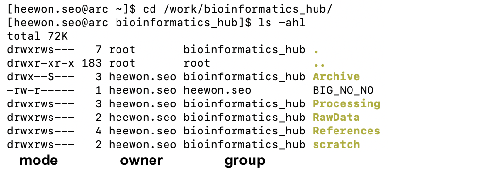
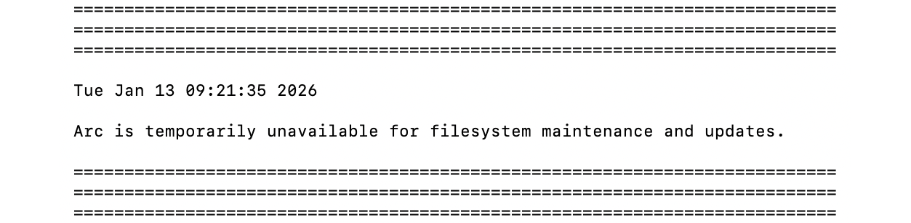

# Advanced Research Computing (ARC)
- **Help everyone understand the options available so we can fully utilize the ARC resources available to us**
- Last updated: January 13, 2026
---

## ARC folder permissions

In research computing, shared storage is intended to support collaboration—especially for commonly reused reference datasets (e.g., human/mouse genomes) that should not be repeatedly downloaded and duplicated across users.

However, **the default folder setup often doesn’t make collaboration easy**. A common problem is that when someone creates a file inside a shared folder, the file may end up owned primarily by that individual rather than by the lab/group. In practical terms, this can mean other lab members cannot read or modify the file—even though it sits in a “shared” location—unless the permissions are manually adjusted.

Ideally, shared folders should be configured so that new files automatically inherit the lab/group ownership (not just the creator’s personal ownership) and come with group-friendly permissions by default. Without that “inheritance” setting, sharing becomes inconsistent: people have to fix access case-by-case, and unless users explicitly ask the admins to adjust the configuration, the shared space can remain difficult to use for day-to-day collaboration.

As a result:

  - New users often re-download the reference files because they cannot access shared copies.
  - Many users are unsure how permissions work or how to fix access issues.
  - In the worst case, folders end up set to overly permissive modes (e.g., `777`) as a quick workaround, which is not secure and can violate licensing restrictions.

**Practical action**: You can email ARC admins and request that your shared storage space be configured so that files created within shared folders automatically inherit the correct group ownership and permissions (commonly done via group sticky bit / setgid configuration and appropriate default permissions).

### Check your folders

You can verify your shared folder permissions by running the following command:

```bash
ls -ahl
```



Then review the output:

  - **Owner and Group columns**: The owner should not be your personal username. The group should be your lab/group name (the group you intend to share with).
  - **Mode/permissions** (first column): Your folder should not be set to something like `rwxrwxrwx` (world-readable/writable/executable). If permissions are world-accessible, the shared group is effectively meaningless because other users on ARC could list and browse your folders.


### What are permissions

On Linux, file access is controlled in three “tiers”:

  1. <span style="color:red"><strong>Owner</strong></span> (u): the file owner (usually you)
  2. <span style="color:red"><strong>Group</strong></span> (g): a defined set of users (e.g., your lab group)
  3. <span style="color:red"><strong>Others</strong></span> (o): everyone else on the system

Each tier can have three basic permissions:

  1. `r` (read): can view/open the file (or list a directory)
  2. `w` (write): can edit the file (or create/delete within a directory, depending on directory permissions)
  3. `x` (execute): can run a program/script; for directories, this means “can enter/access” the directory

### How to read mode/permissions

Each entry is shown as 1 type character followed by 9 permission characters, where the 9 permissions are split into three triplets (user, group, others).

You’ll often see something like this:

  - `drwxr-s---`:
    - `d` (the very first character indicates the type): a directory
    - <span style="color:red"><strong>Owner</strong></span> (first three): `rwx` (owner can read, write/modify, and execute)
    - <span style="color:red"><strong>Group</strong></span> (second three): `r-s` (group can read and enter)
    - <span style="color:red"><strong>Others</strong></span> (third three): `---` (no access)

  - `-rw-r-----`:
    - `-`: a file
    - <span style="color:red"><strong>Owner</strong></span>: `rw-` (owner can read and write)
    - <span style="color:red"><strong>Group</strong></span>: `r--` (group can read)
    - <span style="color:red"><strong>Others</strong></span>: `---` (no access)

### Interpreting 777 (rwxrwxrwx)

These values add up per scope (owner/group/others). So `rwx` = 4 + 2 + 1  = 7, and 777 means `rwx` for onwer, `rwx` for group, `rwx` for others.

  - `r` = **4**
  - `w` = **2**
  - `x` = **1**

### Recommended settings

If you’re not sure how to explain the issue to ARC admins, you can simply ask them to configure the shared directory by setting _the group sticky bit_ so that files and folders created inside automatically inherit the lab’s group ownership and appropriate permissions. This enables sharing by default and avoids manual fixes later.

 1. Enable group inheritance (setgid bit, `g+s`)
    - Ensures that new files and subfolders created in the shared directory belong to the lab group, not just the individual who created them.
 2. Use sensible default permissions (avoid `777`)
    - Shared lab data should be accessible to lab members, but not open to everyone on the system.
    - This improves security and helps maintain compliance with data- and license-related restrictions.

### Permission misuse and licensing example: KEGG

The KEGG database is a valuable resource in medical research and it is not free. Per KEGG’s licensing and access rules, downloaded KEGG resources generally must not be redistributed to non-subscribers; only authorized users should access them.

KEGG-related folders sometimes end up set to overly permissive permissions (e.g., `777`) because users have limited familiarity with Linux permissions. This creates a compliance and risk issue.

**Recommendation**:

  - Keep KEGG data restricted to authorized users only (typically not world-readable).
  - If you are unsure whether your group is properly licensed or how access should be configured, treat KEGG data as restricted and consult a knowledgeable expert before sharing.

---

## ARC file system

Most research data today is large, and while traditional file systems can still function, they clearly have limitations at scale. Many research institutions have already moved toward modern parallel file systems—such as **Lustre** or **BeeGFS** (developed by the Fraunhofer Society)—to better support data-intensive workloads. At UCalgary, however, ARC primarily relies on **NFS** (Network File System).

### Confirming the current ARC file system

You can verify the file system type directly on ARC using standard Linux commands. For example:


```bash
$ df -T /work
Filesystem       Type
netapp1:/ArcWork nfs

$ df -T /bulk
Filesystem        Type
bulknetapp1:/Bulk nfs
```

This output confirms that both /work and /bulk are mounted using NFS.

### Limitations of NFS in shared HPC environments

The main limitation of NFS is that **it does not scale** well under heavy or concurrent use. When one user performs intensive I/O (for example, reading or writing large files), it can temporarily block or slow access for other users. In practice, this often results in:

  - Noticeable I/O “hangs” during peak usage
  - Reduced performance when working with large datasets
  - Bottlenecks when many users access the same storage simultaneously

### Benefits of modern parallel file systems in research computing

Parallel file systems are designed specifically for HPC environments. They allow many users and compute nodes to read and write data at the same time without significantly interfering with one another, and they scale far more effectively as data size and user count increase.

Examples of modern file systems in practice:

  - Lustre was introduced in the early 2000s and is widely used in large-scale HPC environments. It has been deployed at NASA, Oak Ridge National Laboratory, and many systems on the TOP500 supercomputer list.
  - BeeGFS (by the Fraunhofer Society in Germany) is also widely adopted in academic and research institutions, particularly in Europe, due to its flexibility and strong performance for parallel workloads.

**Beyond performance, these modern file systems also offer stronger data-integrity features and are better suited for structured backup and redundancy strategies**. Given that ARC does not currently provide comprehensive backups, moving toward a modern file system would be a meaningful long-term investment in data safety and research reliability.

Each advanced file system has its own strengths and trade-offs, and choosing between them requires careful technical and operational consideration. That decision is beyond the scope of this discussion. However, the more fundamental point is that moving away from a purely NFS-based model would significantly improve the research computing environment overall.

---

## ARC outage scheduling

ARC outages at UCalgary are often scheduled on weekdays during daytime hours, which tends to maximize disruption for users.



In many commercial environments, this would be considered unacceptable (e.g., not being able to access Outlook during work hours). Even in academia, the typical practice is to schedule maintenance to minimize interruption for end users (for example, evenings, nights, or weekends when feasible). This scheduling culture feels somewhat unique here and has a real impact on productivity.

